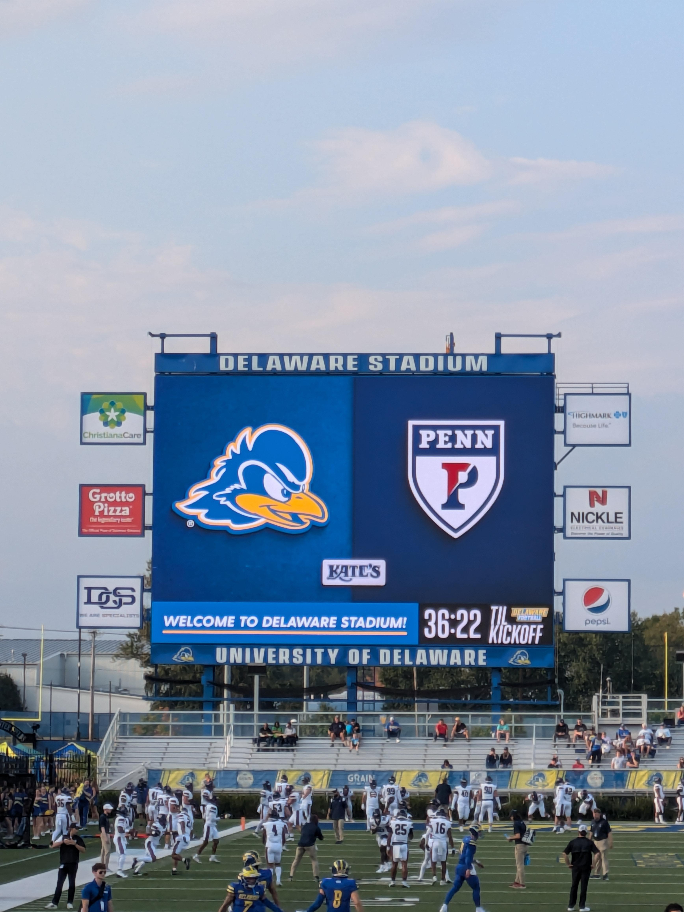
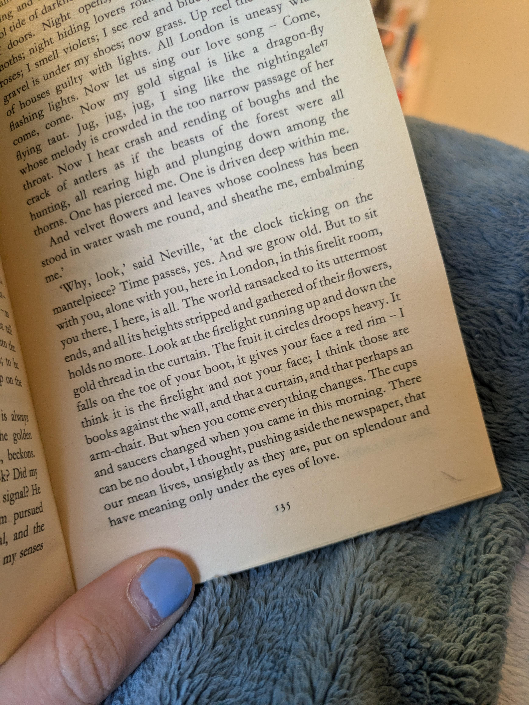

Hello! Happy Banned Books Week :) ! Today I stopped by the table set up in our library, and what do you know, I won their banned-book raffle! I'm looking forward to picking up my copy of Morrison's *The Bluest Eye* tomorrow after classes. They did an absolutely wonderful job setting up the table—they had button making, bingo sheets, guess-the-banned-book, bookmarks, stickers... I'm looking forward to seeing what they have planned for the rest of the week!

- **Books:** well, I finished *The Waves*, finally. I'll admit, it defeated me! I found it unexpectedly difficult unlike the surmountable challenges of *Mrs Dalloway* and *To the Lighthouse*, which remains my favorite. I hope to return to it some day.

  Other than Woolf, I've been working my way steadily through *One Hundred Years of Solitude*, and I think I'll be able to finish it by the end of the month. I've also picked up *Moby Dick* again. (I even borrowed a quote from it as a header for my essay!)

  I made two bookish purchases: firstly, *A Pale View of Hills* by Ishiguro for Bookbug, and secondly, the [James Baldwin and Zora Neale Hurston](https://www.loa.org/subscribe/9-the-baldwin-and-hurston-collection-2/) collection deal from Library of America. I'd heard good things about them, and the price was just too good! Looking forward to *Giovanni's Room* :D

  (Also, side note, but my [book stand](https://www.amazon.com/wishacc-bamboo-cookbook-holders-reading/dp/B074RBL21C) came in and I love it! It's not th highest quality, but it does what I need. I also use it to hold my laptop while taking notes, very handy!)

- Super excited about and loving the singles Peach Pit is putting out for the next album! ([One](https://youtu.be/DKyWzW9WXic), [Two](https://youtu.be/98AUPk4MOAo))

- Today, at the dining hall by my dorm, I wanted pizza, but had never gotten it as it had a tendency of being under done. When ordering it through the kiosk, I inputted my name as "cook crispy please thank you," because they lack a comment function. What do you know, the kind chef cooked my pizza extra crispy! I was a very happy student. Thank you, Chef!

- [Really](https://www.thisiscolossal.com/2024/09/greg-breda-portraits/), [really](https://www.thisiscolossal.com/2024/09/brian-rochefort-staring-at-the-moon/) cool [art](https://www.thisiscolossal.com/2024/08/ethan-murrow-twig/).

- I stumbled upon a [Cat-O-Pedia!](https://www.cat-o-pedia.org/index.html)

- Cool [wall (I touched it)](https://delawarescene.com/organization/1497/the-wall)

- Got really into [this specific character](https://en.wikipedia.org/wiki/Hou_Yi) for a few days. Unfortunately, I could not find a book at the library that told his story or detailed the source. A mystery.

Guess that's it :p peace!

