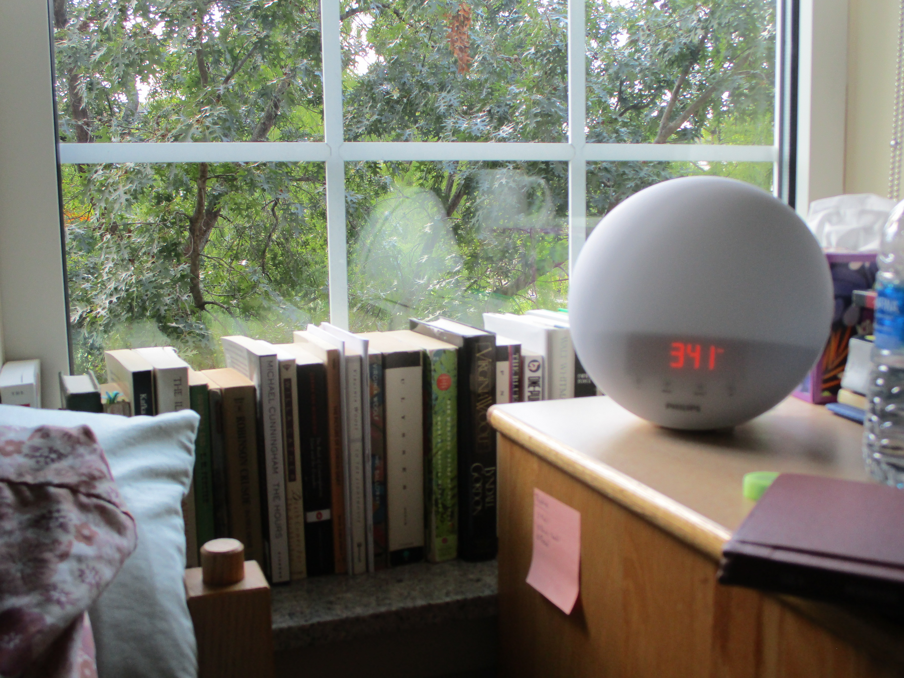
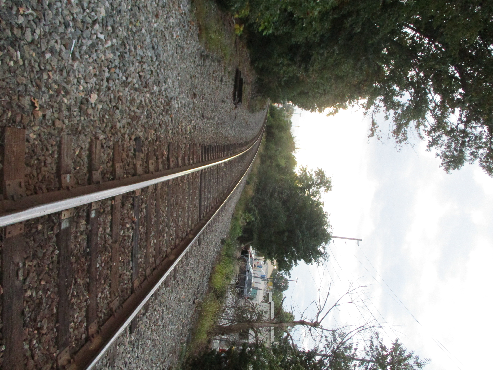
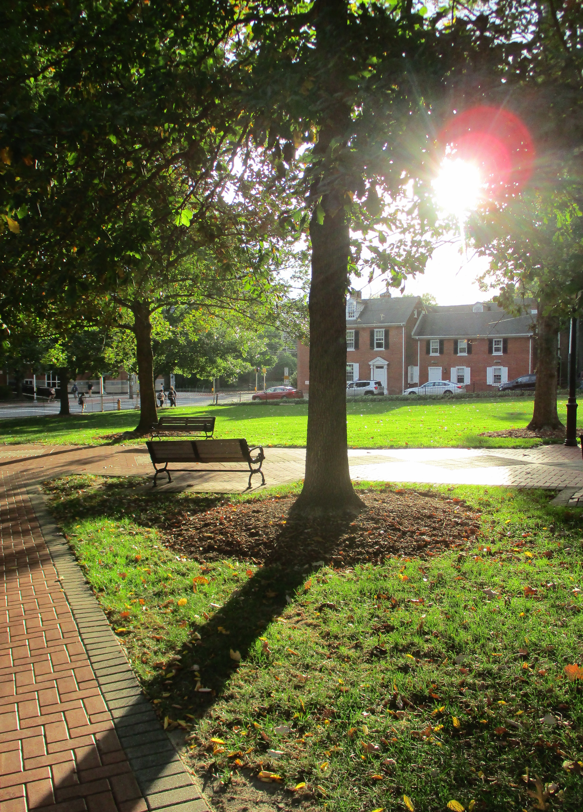

Been a little bit since I posted. It's been busy, but not so much that it's felt "crazy," really. Exams kept me busy, and I'm trying to catch up since I spent this weekend at home with my family. Our high school hosted a marching band competition, which my brother participated in, and we were there the entire day! It was enjoyable, especially since my sister and brother-in-law were visiting.

I reached the end of *One Hundred Years of Solitude* and *Of Mice and Men*. I was sad that I wasn't able to attend the book club discussion for OMaM, but it was moved to this week! I'm excited.

[I made a thread for myself over on LibraryThing](https://www.librarything.com/topic/364676#n8639949) and people are just so nice and welcoming! Looking forward to working on it more.

I've been adventurous in music lately. [Here is my current playlist](https://open.spotify.com/playlist/2PqpOQBcaLsRUN0HRnGhVA?si=oCXBKfxtRPK7m9JD8Q63qQ), but I've been listening a lot on YouTube as well. There are a lot of great live performances on there, and I'm having fun exploring. After finishing *One Hundred Years* I searched to see if there was a band named "Francisco the Man", and lo and behold, [there is](https://open.spotify.com/artist/4IuVLtyKqjn0qmF2Us8vcS?si=X3iHpbJVS16mDjjOLmLoQw), and they're pretty darn good too!

I've been wanting to take more pictures, but I know that I never will if it means taking out my phone, so I brought my little Canon PowerShot that I had left at home with me. I played around with it today, and I like it! I like the ritual of plugging the memory card into my laptop and copying them over.

I had to say goodbye to a childhood friend who's leaving the country for two years, and it hit me emotionally harder than I'd thought it would. My heart often feels like stone, but when it breaks, it sure does crumble.

- Here's a [cool map collection](https://www.davidrumsey.com/).
- I remember reading about Young Werther, but [this short essay poses some interesting questions](https://lithub.com/life-imitates-art-on-the-sorrows-of-young-werther-moral-panic-and-the-power-of-books/)
- I think [this guitar](https://www.youtube.com/watch?v=ozv8ugNm0P0) sounds a lot like [this guitar](https://youtu.be/AW5V8j7OPEg). Am I crazy?

My friend joined my selfhosted linkding instance, and now you can [see their contributed links](https://links.magland.org/bookmarks/shared), which I'm really excited about. If you want to join, just let me know!

