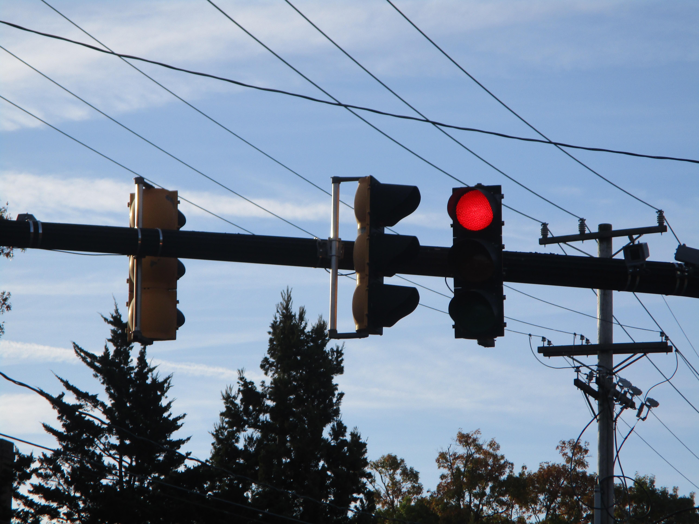

On September 10th I heroically messaged my family's group chat declaring this forthcoming season as my Bob Dylan fall. For the next few days I determinedly listened to nothing but Dylan, his harmonica following me as I stepped on the bus at dawn to when I walked home at dusk. My determination faltered as I drifted into another one of my Beatles crazes for the rest of September.

I returned to listening at the beginning of October, this time focusing on *Blonde on Blonde*. Next up was *Blood on the Tracks*. After that I watched [a youtube video](https://youtu.be/In6gCrGeZfA?si=q0xLEqiWpLgNKaNo) about "All Along the Watchtower," which told me to pay more attention to the lyrics. One day I found myself humming "Mr. Tambourine Man," and that was when things really started to click.

I'm happy to report that I have successfully entered Bob Dylan autumn. It may have taken some patience, but now Bob's lyrics play in my head all day.

But I've come to learn that Bob Dylan autumn doesn't just mean listening to Bob Dylan. It's actually much more than that. Bob Dylan autumn has to do with becoming *tangled up in blue*. Literally, in that my wardrobe is made up of so much blue that many days I find myself to have inadvertantly dressed monochrome. And metaphorically blue. The color, usually so ubiquitous, now stands stark against a red and orange fall. 

The leaves turn yellow, their green reduced to one of its primary colors, but where does the blue go? It goes to me, rubbing off into the blue wind and catching in the creases of my eyes and the folds of my clothes, swaddling me like some painted Madonna.

## Listening To

* Abbey Road[^1]
* Let it Be
* Peach Pit's new album *Magpie*
* Blonde on Blonde
* Blood on the Tracks
* The Freewheelin' Bob Dylan
* The Essential Bob Dylan
* Pet Sounds
* Surfer Girl
* George Harrison
* Men I Trust [live sessions](https://youtube.com/playlist?list=PLp9ta73sprU6vIJSoY_ZZjN_C5cPjczBY&si=ZpEfUzrCkHcWLZ4P)

## Reading

* A Pale View of Hills
* Walt Whitman Selected Poems
* Rainer Maria Rilke Selected Works, Voume II
* Letters to a Young Poet
* Sula
* The Inferno of Dante
* The Essential Emily Dickenson

## Project

I made a zine out of some poetry and lyrics I've been reading. It was my first time making something like this and I'm pretty happy with how it came out. [Here is the PDF](/files/TangledUpInBlue.pdf) if you would like to print it for yourself.

[^1]: Am I just now noticing that magnificent triangle of blue sky on the cover?