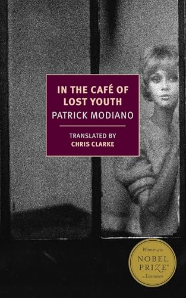

Happy new year! I'm awfully excited about this one. I am going to try and make the most out of it.

That's all I really wanted to say, but I have a few other notes I can stick in here.

For the 2024 Steam Winter Sale I bought:
- Grim Dawn
- Brotato (the family really enjoyed this one)
- Fallout: New Vegas (thank you to my friend Sarah for convincing me)
- Thronefall

I got my hands on a Steam Deck !!! which means I'm getting back into gaming again. I've really enjoyed being able to cozy up and play something, because I really do love video games, but haven't had the time or space to play them.

I read Patrick Modiano's *In the Café of Lost Youth*, and it was great! I'm going to be reading it again, I know it. If wandering the lonely streets of 1950s paris, stumbling through midnight cafés and memories, sounds like your vibe, this book is for you.[^1] This was my first NYRB Classic, and I'm really excited to read *Stoner*, which I also picked up.

I have also acquired the volume of the complete Emily Dickenson. I have set a goal to read one poem a day, in order. We'll see how that goes.

I don't go back to school until February, so I have a very fresh month set before me. Also, my birthday is coming up... 19 years old... wowza.

Best,

Willa M.

[^1]: This book got lower reviews online than I expected. I saw someone on GR call it "boring." Calling this book "boring" is like dismissing a rose because, at a passing glance, it only wavers a little in the wind. If, like a rose, you give this book your real attention, you'll find it blossoming before you, redoubling in it's beauty. I think this is the case for any good book victim to being dismissed as "boring."