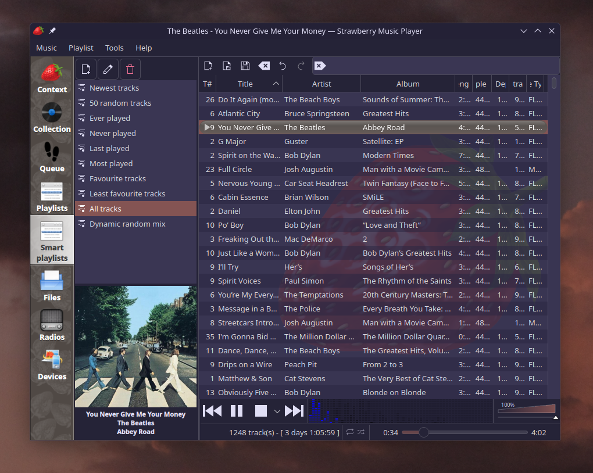
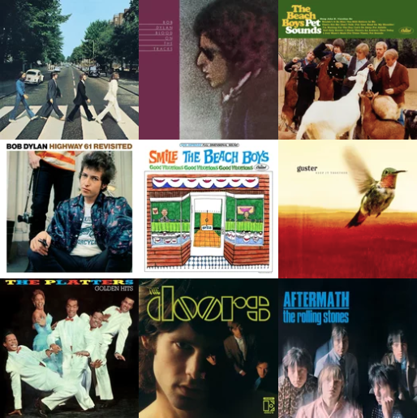

While I was home for winter break (which because of how UD does their scheduling was a very long time) I found myself rummaging through the house looking for things to entertain me. Growing up in a larger family is great for this because you'll never know what you'll find. While I do enjoy the minimalism of dorm life, the joy of finding a forgotten project or discarded gadget is pretty great.

In what we call the music room there is a large cupboard with three shelves. The top is filled with music books and sheet music. The middle is half dusty 45s and half hopelessly tangled audio chords. The bottom shelf contains stacks of CDs collected by my parents over the course of 35+ years.

The genres range everything from classic rock and folk, to Hollywood and Christian. I cataloged all of them in a spreadsheet, but it took a while because I kept looking at the little booklets inside.

Everything changed when I learned about lossless audio compression. Using [fre:ac](https://www.freac.org/), a simple to use CD ripper (highly recommend), I transferred a select few Beatles and Guster albums onto my laptop and phone in FLAC. To my surprise, it sounded *amazing*, much better than Spotify's streaming. What's better, fre:ac checks your rips against other people's files to ensure it is a bit-for-bit copy of the original.

For the rest of the break I ripped as many CDs as I could get my hands on. Now I have my own personal music library of over 100 albums. I just needed something to play them on.

## Mechen M30

I picked the Mechen M30, mostly because it was cheap (got it used for $40) and looked nice. It's a clunky little thing with more than a few annoying quirks, but it sounds great and allows me to distance myself from my phone. I've also enjoyed listening on wired headphones again, since it seems my Pixel Buds Pro are giving out.

Regularly updating the M30 with new music meant having a proper folder structure and management system. For a while I used the [Strawberry music player](https://www.strawberrymusicplayer.org/#), a fork of Clementine. But now I've discovered [Beets](https://beets.io/), which is just awesome! It organizes things very neatly and corrects metadata according to MusicBrainz.

Whenever I rip a new CD, I plug the M30 into the computer and sync Music folders with [rsync](https://www.geeksforgeeks.org/rsync-command-in-linux-with-examples/).

One of the M30's limitations is that it can't show album art larger than 640px. For this, I wrote [a script](https://github.com/willowbit/Mechen-Artwork-Resize) because I couldn't find one online. Hope this helps someone!

I learned a lot through my little journey into the audiophile world. They call mp3 players "DAPs" (digital audio players) and wired earbuds IEMs (in-ear monitors). What a world!

## The Pops

So, what have I been listening to on my new system? Well, mostly the same stuff. I was able to rip nearly the entire Beatles discography, along with a good amount of Bob Dylan. I'm slowly exploring The Rolling Stones, Glen Campbell, The Platters, Brian Wilson, and Tom Rush. Still obsessed with *Pet Sounds*. Thanks to my grandpa's collection, I've been dipping my toes into Jazz.

I'm very happy with this little project. It feels more personal than streaming on Spotify, which has gotten worse and worse over the years. I can listen to all my music whenever I want, offline, in very high quality, and feel like I own it. Organizing the files and editing metadata feels like working a garden, it's really fun!
