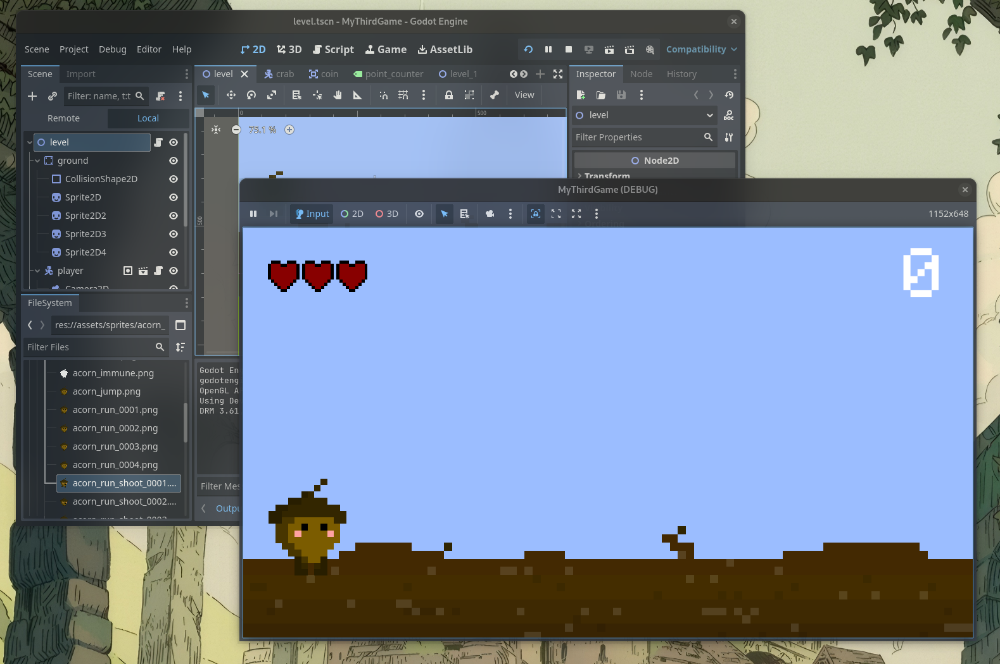
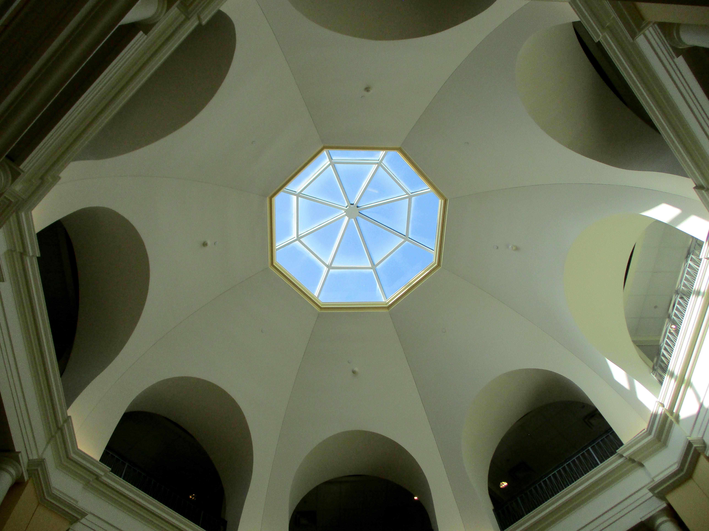
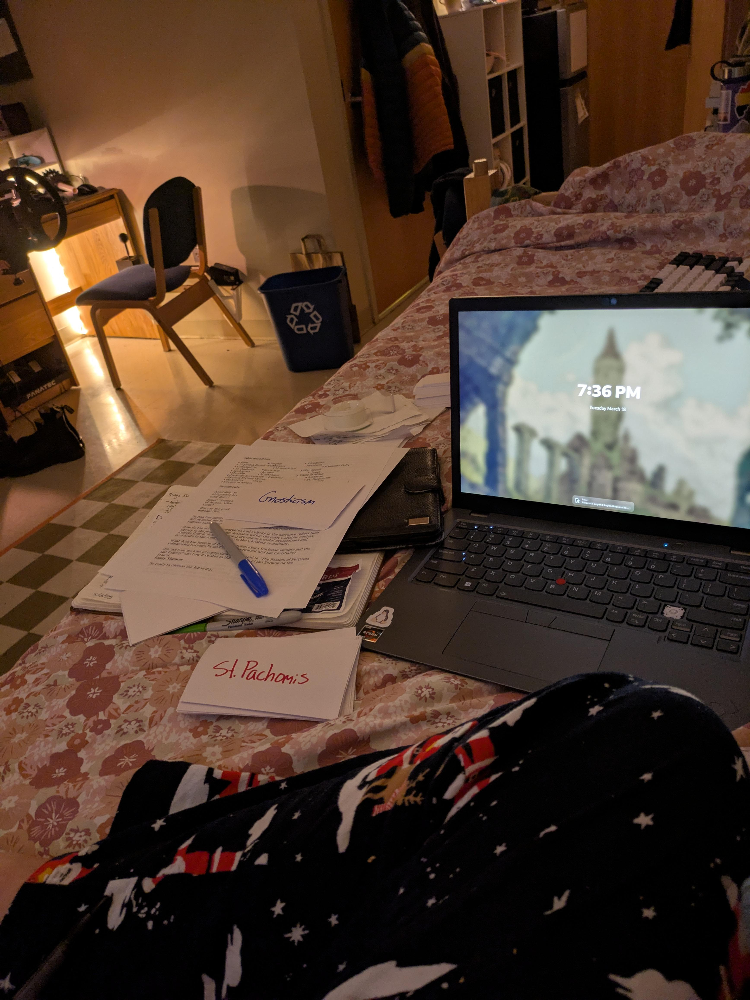
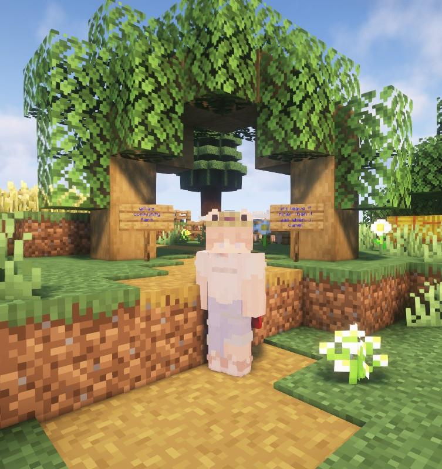

Tomorrow would mark an entire month without a post, and I'm not letting that happen! I'm currently on Spring Break, in my room, surrounded by the mess I've made as I've excitedly regained access to all my tools and thing-a-majigs. Today I had lunch with family, attempted to install Big Sur on a 2013 macbook, failed to do so, and then updated my servers. I love being home and seeing my cats, who, I think, are also glad to see me.

Looking back on the past month, it was okay. Of all things, I unexpectedly got really into game development. What started out as a joke turned into a real interest. I'm convinced there's something addictive about steady, casual learning. While some hobbies require going all in, I've found game development (and technology in general) to be very accessible for casual hobbyists like me. Whenever I opened the Godot engine, I was learning something new almost immediately about how it worked. It was the best feeling when, over the seven days or so that I worked at it, all those little bits of knowledge gradually came together.

There were moments of confusion when I was frustrated I didn't understand, but it was easy to shift my attention elsewhere and work with what I did grasp.

So far, I have made one game worthy of being called a "game." You can play it at [/games/mysecondgame](https://willa.magland.org/games/mysecondgame).

A very exciting development this month is that I bought tickets to see Car Seat Headrest in Philadelphia this September! I'm looking forward to their new album and have been re-listening to their discography recently. I think _Teens of Denial_ is still my favorite, but we'll see. _How To Leave Town_ is really good.

March also saw an improvement in my songwriting skills. A while ago I had decided to release an album before summer. I don't think I'll make that deadline, but certainly before fall. I saw a YouTube video recently that encouraged learning an instrument _through_ the writing of an album. That inspired me.

My music might not be good music, but it is mine. I believe this applies to all art, and it makes creation seem a lot less daunting.

That is all for now. Peace!

