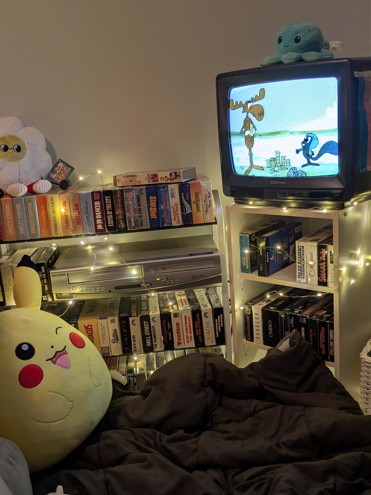
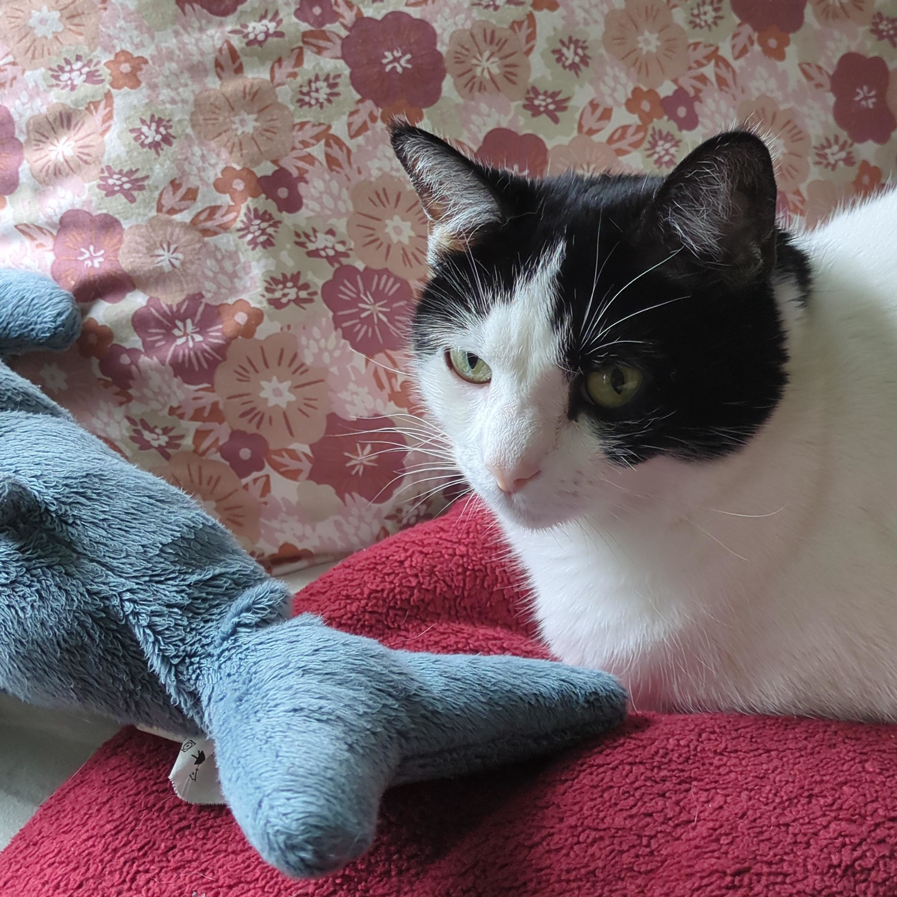
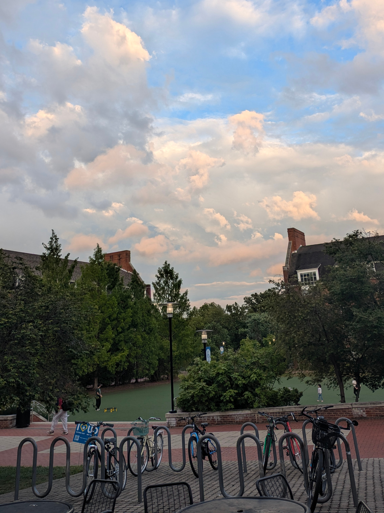
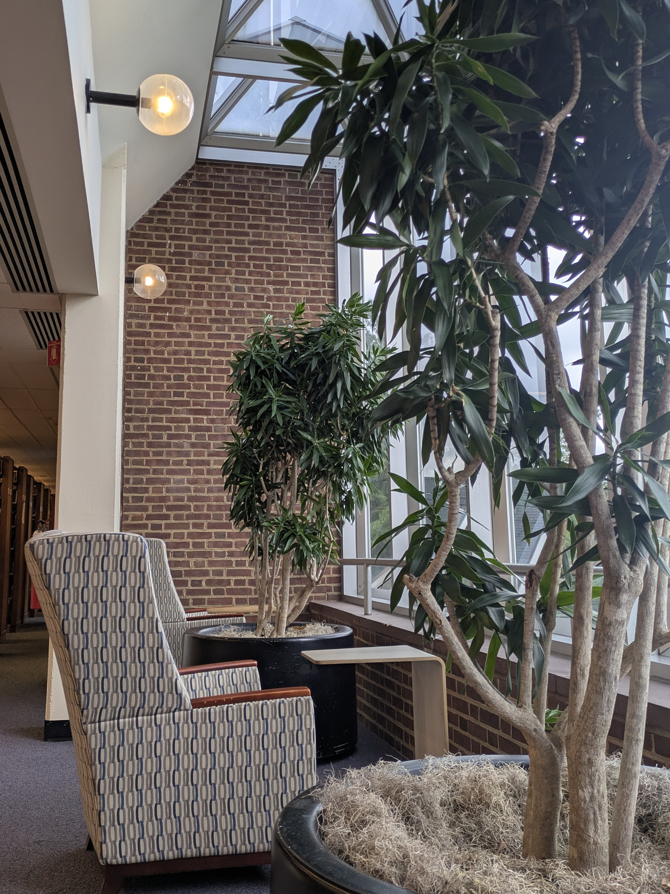

BACK FROM UNIVERSITY! I'm home and happy about it.
- Finals week was rough. I am taking it as a lesson to not procrastinate next semester, but even if I hadn't it still would've been bad. I've been having academic nightmares where I dream I'm still in finals week. So glad it is over!
- That being said, I miss my uni friends. Very much looking forward to seeing them again in the fall.
- I've been overhauling my bedroom hoping to make it a cozy place that reflects who I am! I've always been jealous of people with really decorated rooms.
- The first big step I've taken in this endeavor is setting up a little VHS nook! In 2023 I was driving with my dad when I spotted a bunch of stuff put out on the curb. We pulled over, and I ended up bringing home an entire VHS collection! They had been in boxes under my bed because I had no means to play them, until now. A very kind friend who is also interested in vintage tech gave me an old box TV, and I got a VCR from my grandparents. The CRT only had a coaxial input, which I was worried wouldn't work without an adapter, but everything runs perfect. I can finally watch my collection! I'm very proud with how it all came together. It is very cozy.

- To increase coziness, I went on a full-house hunt and recruited all my favorite stuffed animals from my childhood. Some were under couches, some were in bins, but now they're all back on my bed (until one of my cats steals them).
- The next big step is wall decor. I framed my Her's poster, which looks great, but I just need more stuff. My friend Emily suggested 5 below for this.
- My cat is adorable and makes me happy. She always yells at me to open my window so she can look out.

Reading:
- *Ulysses* by James Joyce. This is because of my friend, Charlie, who read it for their british modernism class, and now is making me read it to do a project together. I'm almost to where I was last time I tried it, but am finding it much easier to understand. Hopefully will finish soon.
- Bits of *House of Leaves* by Mark Z. Danielewski. For a book collection competition I am submitting to. It's weird re-reading it.

Listening:
- More Dylan again, *Blonde on Blonde* and *Blood on the Tracks*. I learned my grandpa was at the Newport festival when he went electric. How cool is that??
- Best of Tom Rush: No Regrets. So good! ("And I get the urge for going....")
- *Pet Sounds*, over and over and over again. Greatest album ever made.

And finally, a few photos I haven't posted anywhere.

Love,

Willa