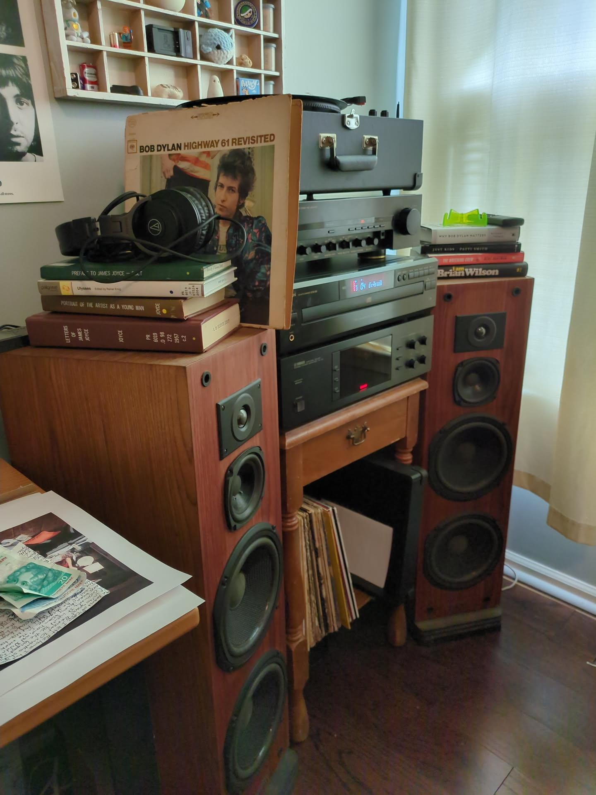
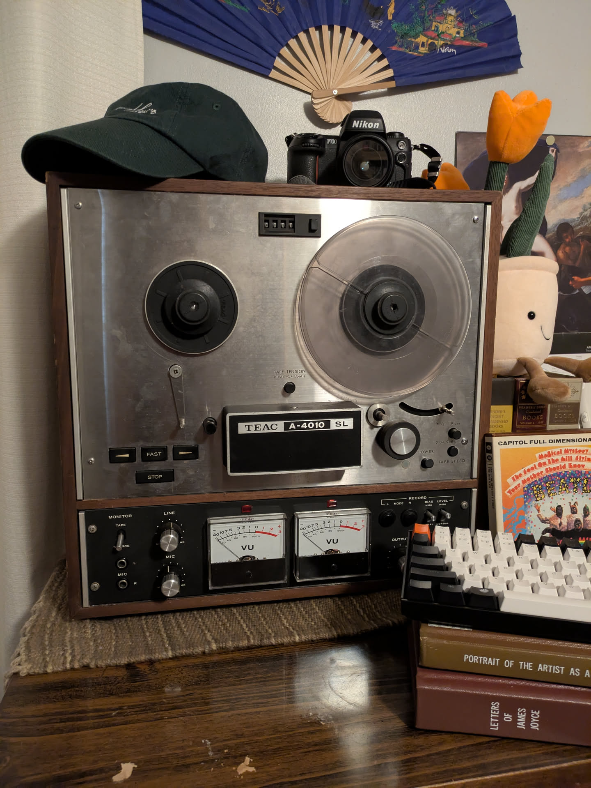

For over a year I have dreamed of turning my bedroom into a sort of "media center:" a space where I could play and manipulate different media formats with ease. I wanted this because I love media, especially older media, which obviously comes in a lot more formats than media today. Playing those formats requires the right equipment, which in hand requires connecting that equipment together into systems.

And, what's better than a good system? There is something satisfying about when things come together and *work*. That satisfaction is why I love my laptop (and why I run Linux on it), why I spend so much time networking the computers in my house together, and why I get giddy when the books I'm reading reference each other. Systems are truly where the fun is!

But anyway, this summer I was able to make that "media center" dream come true. Thanks to a bit of luck, in just my room I am able to play six different media formats:

- DVDs,
- VHS tapes,
- Vinyl records,
- CDs,
- Cassette tapes,
- Digital audio files,
- and Reel-To-Reel tapes

I showcased my little VHS nook in my last post, which is able to play both tapes and DVDs. The tapes were a discarded collection I rescued from the curb. The box TV was given to me by a friend I met last semester, Aidan, who is also passionate about vintage tech. It works great, and I couldn't be more grateful. Finally, the VCR comes from my grandparent's basement.

The other part of my setup came together just in the past week. My grandmother's neighbor was working on moving a long distance, and was asking around for someone to take his Hi-Fi sound system. I jumped at the opportunity and, two six-hour car trips later, had acquired a full setup.

The stack includes a Crosley CR624A turntable, A Denon pre-amplifier, A Denon 5-disk CD player, and a Yamaha power amplifier. The speakers are Epicure model 2s. Since this picture was taken, I have connected a small cassette tape player that had a line-out output, along with my MECHEN M30 mp3 player.

Put together, it sounds amazing. People say the audiophile rabbit hole is an easy one to fall down, but I don't think I have the ears for it.

But that's not all! Along with the Hi-Fi setup, I was given a Reel-To-Reel tape recorder. It is a TEAC A-4010, and let's just say I was surprised to find that it works, at least enough to put out a sound. With the help of my grandpa, I cleaned it up and it doesn't sound too bad. I have around fifty reel-to-reel tapes, including the *Magical Mystery Tour* which was a nice surprise, so it will definitely make a fun thing to throw on once and a while.

The best part about this project was learning how the technology worked, specifically the interplay between digital and analog signals. I feel much more confident in working with audio now, though there's a lot I'm still clueless about. But for now I'm just focusing on enjoying my music collection, trying to ease myself into the world of Jazz. If you have any recommendations, as always, send me an email.

Willa