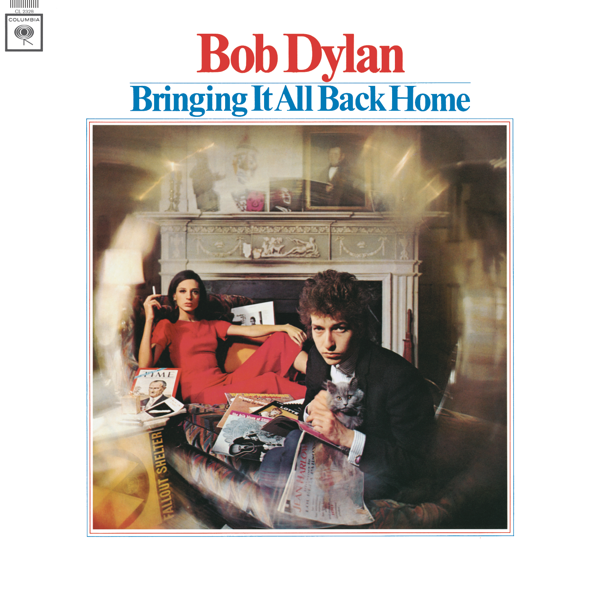
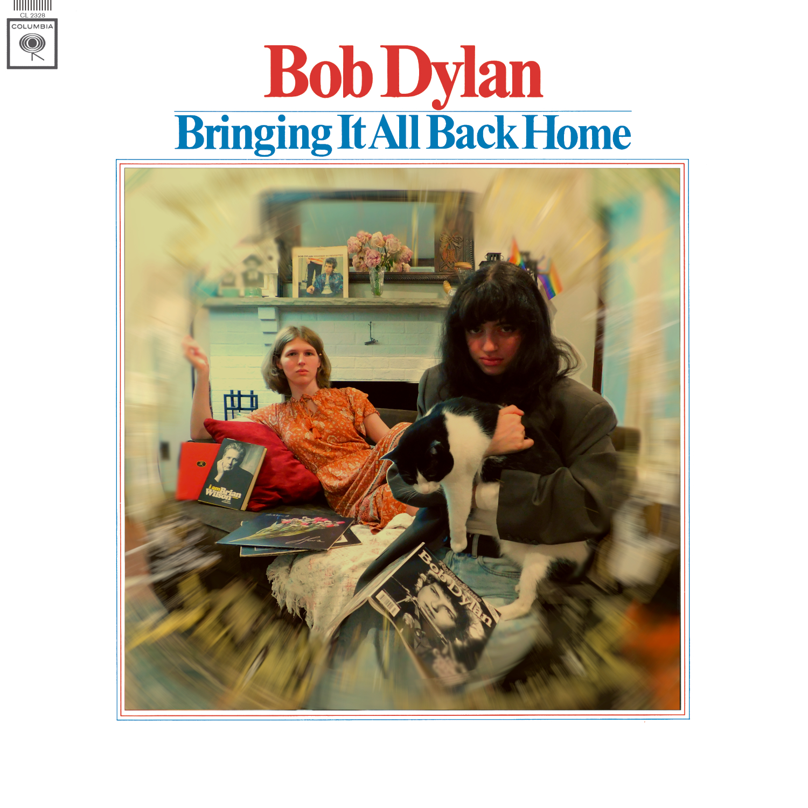

Bob Dylan has some fantastic album covers, but one of my favorites is *Bringing It All Back Home.* In it, he is surrounded by all his favorite things. Magazines, vinyl records, his cat, a woman in a red dress. And to top it off, he's doing his meanie-stare right into the camera, as if he's saying, "look at my stuff, look at my fine taste!"

A few months ago I got the idea to recreate that cover, so I messaged my friend Emily to do it with me. Emily has more of a background in photography, and I don't quite have Dylan's hair like she does.

I angled a couch in front of the fireplace to roughly match the angle in the photo. Looking back, I wish I had gathered more things to scatter around. I think I was too worried about getting the angles correct.

We shot it in two photos, which I stitched together afterward. First, Emily holding Sydney (my cat) and getting that meanie-stare. Second, me lying in the red dress (the best I had was orange) pretending to hold a cigarette.

I did all the editing in GIMP, which I am most comfortable with. After color adjustments I had to try and recreate the fisheye camera lens effect. To do this I first applied a circular focus blur. Then, I went back to the original photo and used the "select by color" to grab the yellowish rays from the lens. I copied this over to our photo and did a circular motion blur on it. This resulted in something I was happy with.

Ultimately, I think it came out great!

