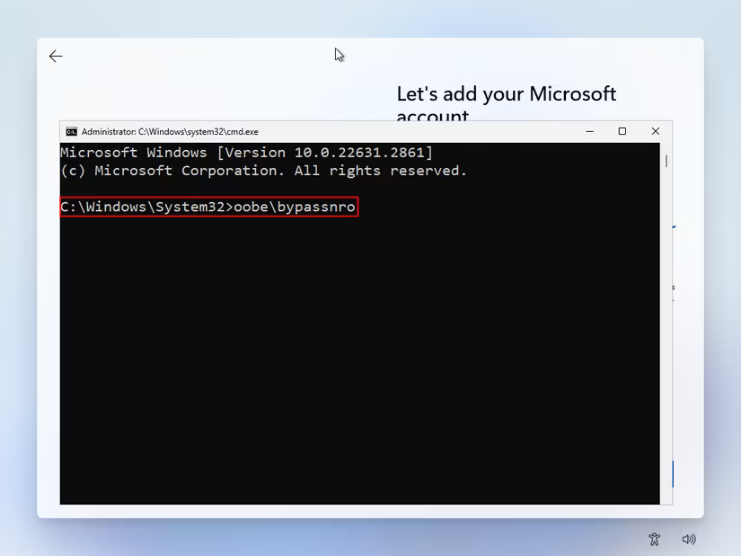
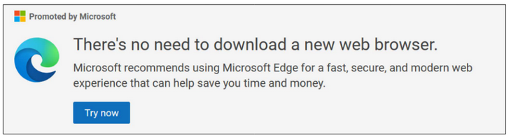
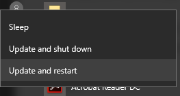

*This is a research paper I wrote for English class, and my professor suggested I post it here to fight the irony of submitting it in .docx format. Thank you, Professsor P!*

Chances are you’re viewing this paper on a digital device, and if it's a computer, it’s probably running a version of Windows, the world’s most widely-used operating system. Since its release in 1985, the Microsoft product has all but dominated the world of personal computing, reaching over 1.4 billion devices in 2022 (Endicott). While this mass adoption has brought conveniences of standardization, the placement of faith in a commercial company has introduced difficulties as well. Rather than moving towards the improvement of Windows on all fronts, Microsoft has gradually begun to craft Windows’ design to serve its own ends. This is seen in the implementation of manipulative design, called “dark patterns,” along with the absence of choice, in the Windows user interface. This design discourages and disables the user from the full functionality of their device, ultimately prioritizing company profitability over user autonomy.  

To understand where Windows has fallen short, it’s important to understand the history behind graphical interfaces. Back when personal computing was new, the user interface consisted of a simple text-based terminal called a command line interface (CLI) that provided full control of the computer to a knowledgeable user. Over the years these interfaces have evolved into the graphical ones we’re familiar with today, often taking the form of the modern desktop. While these graphical user interfaces (GUIs) make computing simpler and more accessible, they introduce an opportunity for bias in their design. If, for whatever reason, a certain function is contrary to the designer’s objective, they may deliberately discourage or completely leave out access to it in the GUI, therefore making it inaccessible to the vast majority of users. The Windows UI does just this to the point where it abandons the original intentions behind a GUI, in some instances forcing intervention through the CLI to access necessary functions. This deliberate design meant to trick the user comes in many forms and is commonly referred to as “dark patterns.”  

This pattern of restriction makes itself clear early on and can be identified in the Windows installation process. On Windows 10, after prompting the user to connect the device to the internet, the setup asks them to sign into or create a Microsoft account. On this page no ulterior option to continue without one is provided, leading the user to believe that it is the only way forward. Only clever users will know to restart the installation process and refuse connection at the internet connection page, upon which Windows allows the creation of a local account. The requirement of a Microsoft account falls under the dark pattern of “forced action,” where a user is required to do something undesirable in order to achieve something else (Brignull 71), and can be traced all the way back to Windows 8.1, released in 2013\. 8.1, though, simply hides the option and displays it “in a color that blends with the background, thereby making it inconspicuous” (Acquisti 26). In Windows 11, the most recent Windows edition, avoiding the Microsoft account requirement through the GUI is impossible. The internet connection page provides no “I don’t have internet” option as on Windows 10; users must have an internet connection in order to set up and use their computer. The only way around the account and internet requirement is manual intervention via the Windows command line, which is only accessible through an unmarked keyboard shortcut (Brookes and Lewis, see fig. 1).  

Fig 1\. Brookes, Tim, and Nick Lewis. “How to Set Up Windows 11 Without a Microsoft Account.” *How-To Geek*, 7 Oct. 2022, [https://www.howtogeek.com/836157/how-to-use-windows-11-with-a-local-account/](https://www.howtogeek.com/836157/how-to-use-windows-11-with-a-local-account/).

While the 8.1 and 10 versions discourage user autonomy by shrouding the option of local setup in dark patterns, Windows 11 chooses to completely exclude the function from the GUI. The gradual increase in restriction, from hiding, to obstruction, to finally deletion, of GUI elements illustrates Microsoft’s intention of implementing and exercising its will over the user. It is only with a Microsoft account that the user is able to download and make purchases on the Microsoft app store. While a true GUI would offer consistent, clear options for both creation of local and online accounts, Windows instead herds users toward the choice most profitable to Microsoft.  

Microsoft extends its influence far beyond the Windows installation process, carefully shaping how users interact with their computers day-to-day. On a newly installed Windows system the user is provided with a variety of preinstalled apps. Included in these is the Microsoft Edge web browser. Edge, released in 2015, is the successor to Microsoft’s Internet Explorer which once ruled the browser market with a massive 95% market share before the takeover of Chrome (“Microsoft’s Internet Explorer Losing Browser Share”). However, while Windows commands 73% of the desktop market share (“Desktop Operating System Market Share Worldwide”), Edge only accounts for a mere 5% of browsers (“Internet Browser Market Share 2012-2024”). This means that users overwhelmingly install Chrome on Windows devices over using the preinstalled Edge.  
	
This is a stunning example of millions of users exercising choice, and one that Microsoft couldn’t let go unchallenged. In “Over the Edge.,” Brignull and Bowles analyze the various UI elements Microsoft has implemented in order to discourage Windows users from installing and using browsers other than Edge. Their report focused on three research questions about what the user could accomplish without encountering “harmful interference:” one, “\[if\] Windows and Edge allow users to download and install a different browser,” two, “\[if\] Windows and Edge allow users to set a different browser as their default,” and three, “\[if\] Windows and Edge respect users’ choice of default browser and allow them to continue using it.” After completing their analysis of the color, wording, and placement of various GUI elements, the authors were able to identify nine specific dark patterns used by Microsoft to hinder user choice. Some of these include forced action, nagging, obstruction, and trick wording, as well as disguised ads and visual interference (see fig. 2). With this in consideration, Brignull and Bowles came to the conclusion that “Microsoft has used harmful patterns across all three” of the previously listed user journeys, and that they go beyond “acceptable persuasion” and adopt methods of “coercion, deception, and manipulation” to herd users back to the preinstalled Edge.  

Fig. 2\. A dialog displayed by Bing when the user searches for other web browsers, identified as a disguised ad and visual interference. From Brignull, Harry, and Cennydd Bowles. *Over the Edge: How Microsoft’s Design Tactics Compromise Free Browser Choice*. Jan. 2024, p. 29, [https://research.mozilla.org/files/2024/01/Over-the-Edge-Report-January-2024.pdf](https://research.mozilla.org/files/2024/01/Over-the-Edge-Report-January-2024.pdf).

This embedded influence wouldn’t be so trivial if it weren’t for the fundamental part web browsers play personal computing. The web browser is one of the “most used applications on every computational device” (Carrol, n.d.), allowing the user to complete various tasks without any local installation necessary. With the adoption of Google Docs, online email, and other web applications, many users now spend the majority of their time on their computers using web browsers. With this in mind, it makes sense why so many users go out of their way to use their preferred web browser, a component responsible for a large part of their computer’s intended use. While users are aware of their needs, Microsoft only knows profit. The discouraging and disabling interface designs implemented by Microsoft are intended to boost browser market share and profit, not user autonomy. In the event where a user fails to navigate or relents to these dark patterns, they are placed in a position where their autonomy over their device may be limited due to either unfamiliarity or features that fail to accommodate them.  

So far we have seen how Microsoft uses design to influence user choice in the setup of their device and its day-to-day usage, but unfortunately the pattern continues. Because of the role operating systems play, they are constantly under developer maintenance to ensure priorities such as security, compatibility, functionality, and responsiveness. These changes are pushed to computers in the form of updates. In the case of Windows systems, a common annoyance for users is the lack of control they have over an update’s installation. This struggle, familiar to any user of Windows, is studied in Ahuja et al.’s article “Why Doesn't Microsoft Let Me Sleep? How Automaticity of Windows Updates Impacts User Autonomy.” Through interviewing ten Microsoft Windows users, the authors found ten design elements that impacted freedom of choice, control, and agency when faced with system updates.  

The first of these, freedom of choice, was classified as concerning “\[the\] choices or options available to an individual” regarding updates. Through the interviews, the participants described being faced with multiple promptings to install the update, along with limited postponing or scheduling options. These design features are important in conjunction with the third frustration expressed: the lack of access to the system while the update was being applied (3). The repetitive prompts, indicative of the “nagging” dark pattern, along with the limited timing options complicates the user’s ability to avoid the update (see fig. 3), and when they fail to do so, they lose all functionality for the time period in which the update is installed.  

Fig. 3\. A possible example of “tricky buttons” referenced Ahuja et al.’s study. From “Windows 10: Forced Update.” *UXP2: Dark Patterns*, [https://darkpatterns.uxp2.com/pattern/windows-10-forced-update/](https://darkpatterns.uxp2.com/pattern/windows-10-forced-update/). Accessed 5 Nov. 2024\.

These difficulties are exacerbated when compared to the other classifications discussed, namely user control and agency. The interviewees shared experience with updates being automatically applied during system startup, shutdown, or in the background without their consent. They also expressed frustration over certain updates being mandatory and a lack of knowledge of which features are included (4, 5). When a user is successfully able to avoid an update, despite Microsoft’s best efforts with “nagging” and restrictive prompts, Windows takes matters into its own hands and applies the update against their wishes. Microsoft doesn't inform users about the update's features as an incentive to upgrade because, in the end, users have no choice not to.  

You might be able to see where this is going. Although users can pause automatic updates for seven days at a time in Windows settings, the longer thirty-five day option is hidden in the page’s “advanced options.” After this date, the user will have to update their computer before being able to pause them again (Irvine). This hiding of this option, along with its exchanging nature, is an example of the obstruction and forced action dark patterns discussed earlier. In order to bypass the frustration of unexpected updates, the user must intermittently accept them, effectively exchanging consent for convenience. If the user wants to turn off updates indefinitely, they must manually turn off the Windows update service, which is only accessible through, you guessed it, an unmarked keyboard shortcut (Irvine). The process to disable them exists in an interface separate from the settings users are likely to be familiar with, reflecting the process required to avoid the Microsoft account requirement during installation.  

To a careful eye, the pattern is clear. From the very moment a user powers on their computer for the first time, through its everyday use, and until its final automatic update, Microsoft imposes its miserly control onto the user. This is done through “dark patterns” in the Windows’ graphical user interface, where specific design choices of color, wording, and placement can complicate actions that aren’t preferable to Microsoft. In certain cases, these functions are completely removed from the GUI, placing them out of reach of the average user. What results is a delicate dance between user and Windows, where one false slip can result in a temporary restriction of device functionality. When considering the amount of work the user must do in order to make their computer function the way they’d like, one must question the relationship between Windows and Windows users. If the former is the one making demands of the latter, who is the profiting user, and who is the tool?

# Works Cited  

Acquisti, Alessandro, et al. “Nudges for Privacy and Security: Understanding and Assisting Users’ Choices Online.” *ACM Computing Surveys*, vol. 50, no. 3, May 2018, pp. 1–41. *DOI.org (Crossref)*, [https://doi.org/10.1145/3054926](https://doi.org/10.1145/3054926).  

Ahuja, Sanju, et al. “Why Doesn’t Microsoft Let Me Sleep? How Automaticity of Windows Updates Impacts User Autonomy.” *arXiv.Org*, Jan. 2024\. *ProQuest*, [https://arxiv.org/abs/2401.06413](https://arxiv.org/abs/2401.06413).

Brignull, Harry, and Cennydd Bowles. *Over the Edge: How Microsoft’s Design Tactics Compromise Free Browser Choice*. Jan. 2024, [https://research.mozilla.org/files/2024/01/Over-the-Edge-Report-January-2024.pdf](https://research.mozilla.org/files/2024/01/Over-the-Edge-Report-January-2024.pdf).  

Brookes, Tim, and Nick Lewis. “How to Set Up Windows 11 Without a Microsoft Account.” *How-To Geek*, 7 Oct. 2022, [https://www.howtogeek.com/836157/how-to-use-windows-11-with-a-local-account/](https://www.howtogeek.com/836157/how-to-use-windows-11-with-a-local-account/).  

Busch, Kristen E. *What Hides in the Shadows: Deceptive Design of Dark Patterns*. \[Library of Congress public edition\]., Congressional Research Service, 2022\.  

Carroll, Fiona. “Human-Browser Interaction: Investigating Whether the Current Browser Application’s Design Actually Make Sense for Its Users?” *International Journal of Human–Computer Interaction*, pp. 1–12, [https://doi.org/10.1080/10447318.2023.2266789](https://doi.org/10.1080/10447318.2023.2266789).  

“Desktop Operating System Market Share Worldwide.” *StatCounter Global Stats*, [https://gs.statcounter.com/os-market-share/desktop/worldwide](https://gs.statcounter.com/os-market-share/desktop/worldwide). Accessed 17 Oct. 2024\.  

“Internet Browser Market Share 2012-2024.” *Statista*, [https://www.statista.com/statistics/268254/market-share-of-internet-browsers-worldwide-since-2009/](https://www.statista.com/statistics/268254/market-share-of-internet-browsers-worldwide-since-2009/). Accessed 5 Nov. 2024\.  

Irvine, Robert. “How to Turn off Automatic Updates in Windows 10.” *Tom’s Guide*, 2 Sept. 2022, [https://www.tomsguide.com/how-to/how-to-turn-off-automatic-updates-in-windows-10](https://www.tomsguide.com/how-to/how-to-turn-off-automatic-updates-in-windows-10).  

“Microsoft’s Internet Explorer Losing Browser Share.” *BBC News*, 4 May 2010\. *www.bbc.com*, [https://www.bbc.com/news/10095730](https://www.bbc.com/news/10095730).  

“Windows 10: Forced Update.” *UXP2: Dark Patterns*, [https://darkpatterns.uxp2.com/pattern/windows-10-forced-update/](https://darkpatterns.uxp2.com/pattern/windows-10-forced-update/). Accessed 5 Nov. 2024\.