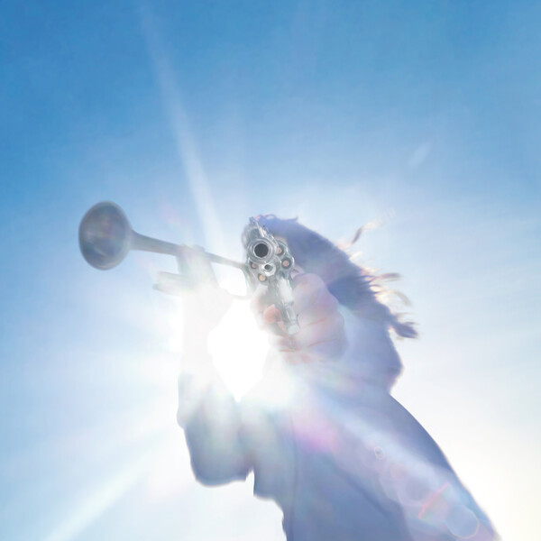

> "I change during the course of a day. I wake and I'm one person, and when I go to sleep I know for certain I'm somebody else. I don't know who I am most of the time. It doesn't even matter to me." —Bob Dylan

Music might be the closest thing I have to a religion. That's not to say that I'm not religious—if you know me well enough that's clear. But music is one of those things I can say I wholly believe in, to the extent that I indulge in it every day. How I listen to music, though, has changed a lot over my life, and over the past few years it's taken on a more ritualistic feeling.

I've long left playlists behind for albums, and instead of sampling a large variety of artists, I tend to commit to just one for weeks and months at end. How long I stick with them depends on how long it takes for it to do "the thing." One way to describe "the thing" could be: however long it takes for me to get killed.

The first time I tried the "getting killed" process was with Car Seat Headrest. For a reason I don't remember, I wanted to learn to enjoy CSH, so I listened to *Teens of Style* over and over. For a long time I didn't feel anything, but then I gradually learned the songs and the albums. Almost four years later I consider them one of my favorite bands. When I play them for my dad, he thinks it's awful, and I can't disagree—that's what I though too when I started out.

People usually describe this process as "getting into" an artist, which is a much more comforting way to put it. "Getting into" something implies a static self, a "me" that can move in and out of things. We spend our lives operating under this assumption of the self.

The other way of thinking about it is that the art gets into me. This *feels* more accurate. When I'm listening to an album dozens of times over, I'm getting to know it, learning all of its lyrics and instrumental intricacies. It involves listening to the music such that I can play it in my mind on command.

Uploading music to my internal boombox isn't the goal though. The goal is to etch the music into my soul such that when I listen to the song it feels like I am being played. I'm no longer hearing the music, I am hearing the echoing chasms of my memory. It becomes a part of me, changing the "me" forever. I get killed.

You could argue that this becoming is what music really is, that the first time you listen to a song it is nothing but noise. Sure, the first time you listen to a song can be an important experience, but only because it somehow resonates with something already inside you. Music that is completely foreign to us is very hard to enjoy for that reason, out of which the myth of "taste" is born.

The truth is, you can learn to love any music out there, you just have to get killed first.

The process of getting killed over an artist takes different amounts of time for me depending on the music. Car Seat Headrest took six months, Bob Dylan took three, *Pet Sounds* took about two weeks, and most recently, Geese's *Getting Killed* took only a few days.

The journey for *Getting Killed* was the same—at first I just heard noise, but it was *new noise,* unlike anything I'd ever heard before. Recommendations from tasteful friends and a post on MetaFilter told me that this was something worth spending time with and getting to know. So I put it on again, and again, and again... Now I wake up to it playing in my head, I listen to it in the car, I see it in the books I read, etc. etc..

Listening to *Getting Killed* feels exactly like what it is titled. It is visceral existentialism crafted with unreigned experimentation, based in everything and nothing at the same time. I really like it. When I listen to it, I feel a vague and beautiful truth rise up, filled with strange specificity and new feeling. That's what music is supposed to do, I think, and I think that's worth getting killed over.

I'm not at all saying this approach to music is unique, but trying to put it into words helps me understand it more.

Go listen to *Getting Killed!*