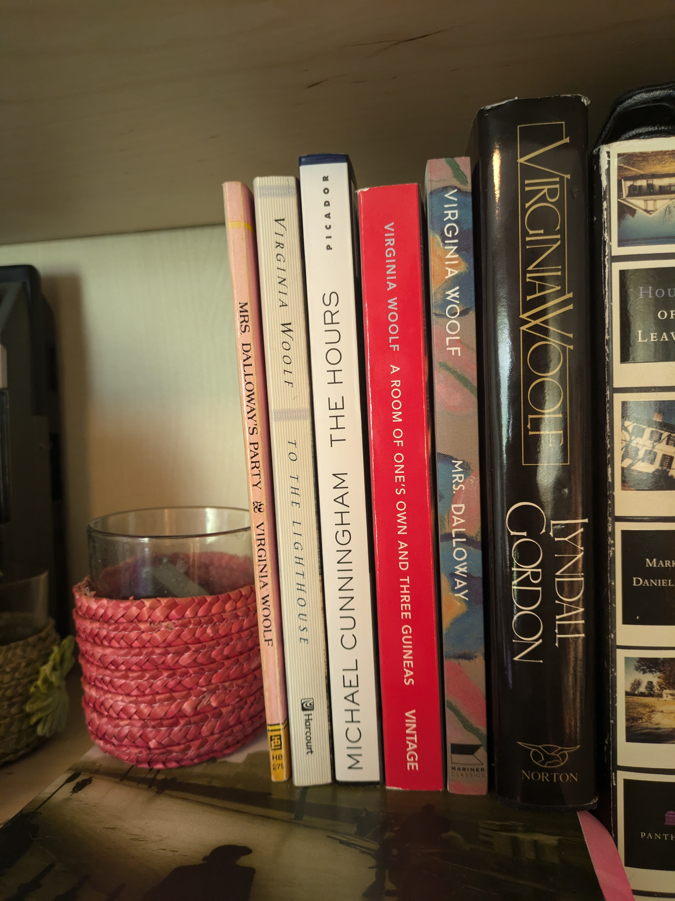

I traveled around Washington with my family for a little over a week. My sibling C lives up there, so we picked them up, stayed a few days in an AirBnB, hiking and walking and such, and then went back to Seattle for Seattle-y things. It was fun. It was beautiful.

Here are some [photos](https://flic.kr/s/aHBqjBAMDN). This is my first time using my Flickr account, so I hope I did everything right! Enjoy!

We visited a few bookshops while we were there. At [Charlie's Queer Books](https://charliesqueerbooks.com) I got _The Hours_ by Michael Cunningham, and at [Ophelia's Used Books](https://www.opheliasbooks.com/) I got _Mrs Dalloway's Party_ and _A Room Of One's Own and Three Guineas_. I'd known about _Mrs Dalloway's Party_, and had previously failed to find the ebook. The cashier said that it was a bit elusive, and that the one I had picked up was actually the first paperback edition published! Which I was very happy to hear.

My Virginia Woolf collection has grown substantially.

Notes:
- I've been enjoying [Bookjotter](https://bookjotter.com/), who's weekly wrap ups nearly burst with quality conent. It's a little overwhelming. I love it.
- Via MeFi, [Flaming Puck Hockey](https://lptv.org/flaming-puck-hockey-is-unicon-21s-hottest-event/).
- I have been thoroughly enjoying making booklets, which have been the answer to the constant guilt of printing too much. I love tech but I just cannot immerse myself in text-on-screen! Thanks to [this](https://askubuntu.com/questions/214538/printing-in-booklet-format), I was pointed in the right direction and have been printing using Boomaga. This way I can read a 22 page essay while only using 6 pages of paper. Brilliant!
- I'm reckoning with myself whether or not to watch the 1983 [_To the Lighthouse_ movie](http://www.cinemamuseum.org.uk/2019/hugh-stoddart-presents-to-the-lighthouse-1983/). I think I'll base my decision on if it got good reviews.
- My friend got me on [Whering](https://whering.co.uk/), and I had a wonderful time taking pictures and logging my wardrobe. We'll see where it takes me.