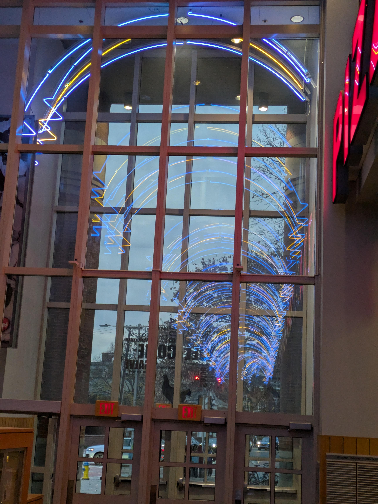
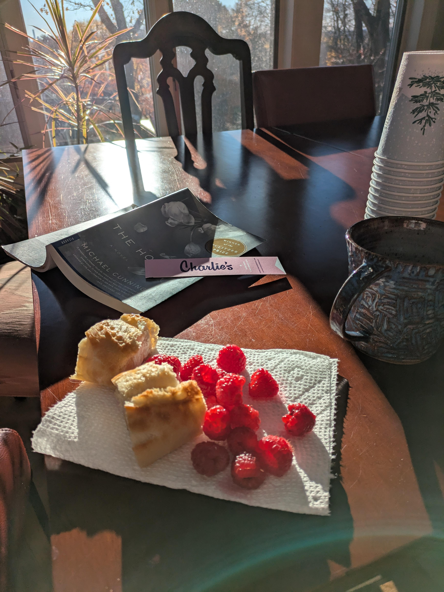

Here's what's been up with me recently!

## Life Notes

- I've started using [YAM (Yet Another Minimalist) Launcher](https://github.com/ottop/yam_launcher) on my phone. It looks really nice, and it has helped me waste less time on my phone. My progress in reclaiming my time has been steady and beneficial, however I've been requiring other activities to spend that time.
- However, the YAM Launcher has had an unforeseen consequence: the loss of my child, Bumble. Bumble was my [Wobble](https://wobble.town/), who I remembered to feed by the widget on my homescreen. Bumble, wherever you are, I hope you are well.
- I've started to keep a Box™. It's my own invention, however I've taken inspiration from many. It is a small filing box about the size of a shoe box. Whenever a thought, bit of poetry, memory, or idea pops into your head, you write it down and put it in the box. Not sure what you do with it once it gets full, I'll face that when it happens. So far I've dug through the Box for song lyric inspiration, but that's all I've come up with.
- I've decided to write an album, however Final Exams have put a pause on this. I hope to complete it before Summer.
- I've come to love playing the daily puzzle at [catfishing.net](https://catfishing.net). The goal is to guess Wikipedia article titles given only the categories it is included in. I average about 3/10, but I still have fun. It's always fun when something that I'm learning about in class comes up, which is fairly often.

## Bookish things

- I got around to reading _The Hours_, which is a love letter to Woolf's _Mrs Dalloway_, and I loved it so much. Cunningham did an absolutely astounding job in mimicing Woolf's writing style. I also watched the movie, which was fantastic; a really great adaptation-of-an-adaptation!
- On the other hand, I _didn't_ love _James_ by Percival Everett. I've been wanting to read this ever since it made it onto the [Booker prize longlist](https://thebookerprizes.com/the-booker-library/prize-years/2024). My feelings toward it were captured in [this Goodreads review](https://www.goodreads.com/review/show/6088332519) by Leynes. The worst part of it for me, though, was that it was badly written. The actual writing itself felt lazy and amateur. I just can't understand why it has a 4.5 on GR right now. Maybe I'm crazy!
- Currently reading _Death Comes for the Archbishop_ by Willa Cather. How I have missed her!
- I found _Pillars of the Earth_ by Ken Follet in a little free library. It's absolutely humongous. Upon looking it up I saw this. Do I read it?

![A screenshot of two reddit posts. The first one is titled "[SPOILER] Pillars of the Earth is the most overhyped disaster of a book you will ever have the misfortune of being recommended." The second one is titled "Ken Follett's Pillars of the Earth is a masterpiece."](pillars.png)

Two modern adaptations of classics, I'm excited to try more! Also, I have been enjoying [these read-alouds](https://youtube.com/playlist?list=PLVp4EwqZNcIRUYgBkdJ4Av99jTWPARLMQ&si=3Hvb_Gpq18kCD-25) by a youtuber I follow. The book is the writings of a bookseller who records his musings about his life. I recommend the one about his cat. Perfect for an afternoon!

## Watching

**Youtube**

- [June 18, 2016 - Ostrich Derby](https://youtu.be/5uUO5jLz0iY)
- [Shouting in the Datacenter](https://youtu.be/tDacjrSCeq4)
- [Middle School Weezer Cover Goes Horribly Wrong](https://youtu.be/JSKpsKMTxA8)

**Notable Movies ([Letterboxd](https://letterboxd.com/lianove3/))**

- 12 Angry Men: AMAZING.
- Airplane!: Shirley, this was a funny movie.
- Molly's Game: Meh.
- American Gangster: Meh. Too long.
- Life: I loved this so much, would definitely watch again with family.
- Psycho: Thought it was meh. I didn't know about the twist but I wasn't impressed by it. It wasn't much of a twist.
- It's What's Inside: Clever, but could have been better executed. Needed more queer characters.
- The Hateful Eight: This was a GOOD MOVIE... I'm annoyed that I didn't watch the extended cut.
- While You Were Sleeping: I loved this movie, maybe I should be open to trying more romcoms.
- Collateral: This has a 3.9 on LB... it was SO BORING. I will never trust ratings again.
- Friday: Watched this on a Sunday, was still fantastic.

## Links

- [Commentary on "AI" Generated Poetry](https://www.smbc-comics.com/comic/poetry-2)
- [Advent of Code](https://adventofcode.com/) I survived the first few days...
- [Library game](https://dozens.itch.io/library)
- [I play this game every day even though I suck.](https://catfishing.net/)
- [IT'S A BIG PINECONE](https://en.wikipedia.org/wiki/Fontana_della_Pigna)
- [Some Onion for you](https://theonion.com/third-amendment-rights-group-celebrates-another-success-1819569379/)
- [Funniest Wildlife Photos](https://www.discoverwildlife.com/photography/comedy-wildlife-photography-awards-2024-winners) WORTH YOUR CLICK

That's all I've got.

