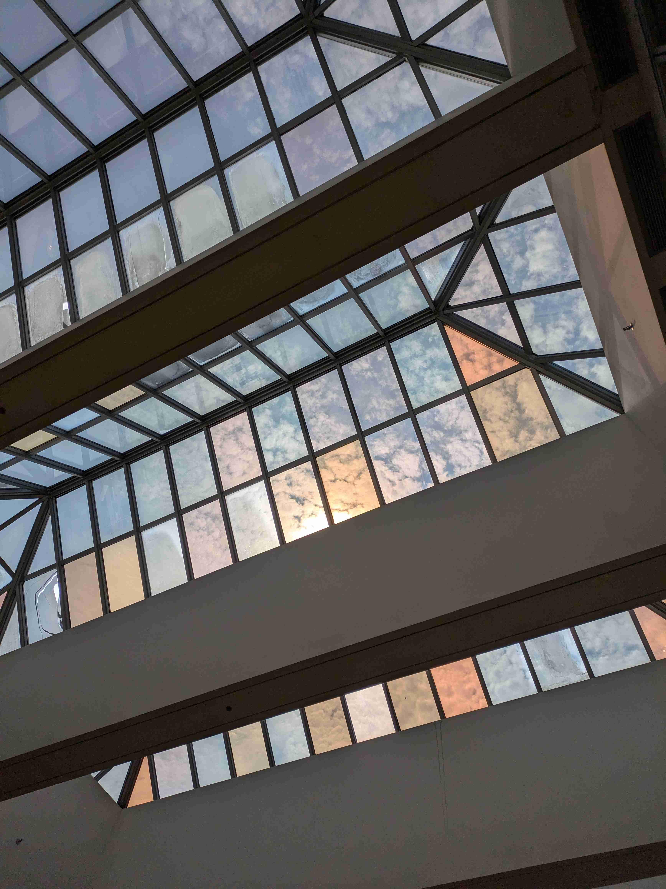

Hi! It's been a little bit! I've been busy doing things like [moving into college](https://www.udel.edu/), which has been crazy. I've learned that the best part about being a student is the access you get to their libraries, both physically and digitally.

My weekdays alternate between 9 AM classes (M,W,F) and afternoon classes (T,Th), so it's not too demanding. I've established myself in some sort of routine in which I have breakfast with the same people, take the same bus, and eat the same sandwich for lunch. I'd like to believe that it's the same squirrel playing in the trees wherever I choose to stop and read. I will pretend.

## Reading

I'm trying out [Librarything](https://www.librarything.com/). I wasn't super pleased with Bookwyrm, and I REFUSE to get on Goodreads, so this was a pleasant surprise to find. It seems more of my vibe with its forum-style groups and rational look. Everyone on there has been super kind to me so far, so [check me out!](https://www.librarything.com/profile/lianove3)

In terms of books...

**Finished:** Pnin for bookbug.

**Currently Reading:**
- V. Woolf, *The Waves*
- G. García Márquez, *One Hundred Years of Solitude*
- *The Bhagavad Gita*

## Watching

I'm not allowing myself to begin any television shows, for the sake of my productivity. So I've been watching movies.

- *Twister*: This was surprisingly fun, I really liked it.
- *Trap*: This *sucked!* I was so dissapointed. The premise was so cool, and then it just got weird.
- *Baby Driver*: Watched on Netflix. Really enjoyed it, maybe my favorite opening scene ever? Anyway, I was listening to *Sheer Heart Attack* by Queen for a few days afterward.
- *Bullet Train*: Also on Netflix. Good vibes, good story.
- *Kill Bill: Vol. 1*: This was awesome! Really cool style, but what can you expect from the Q. I don't feel super pumped to immediately watch Vol. 2, but perhaps in the next week.

So, basically, I like everything.

## Listening

I have been soooo boring. It's just been Mac DeMarco for the most part. Yup. A looot of Mac.

I'm still feeling good about the new site. Eleventy is still working well, though I think I need to continue to work on footnotes.