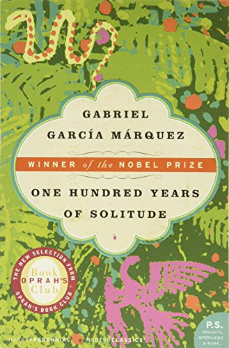

(Making this page just to say that I'm really enjoying it so far! ...but I'm only just past the halfway mark. I'm going to try my best to finish it by the end of the month, but it's going to be tight.)

I finished last night, 9/26/24. Wow, what a book. There has only been one other book that has messed with me the way this one did, to the point of making me feel physically sick.

I liked it, I really did. I would say that the style was unlike anything I'd read before, but that would be hypocritical as the only thing I can liken it to is scripture, specifically Genesis. It feels, to me, as the greatest example of how writing can manipulate the mind in different ways. When I reached that last page, it truly did feel as though I had witnessed one hundred years, and I could almost taste the solitude in my mouth. I'm the one who has to bear this century of memory that has been blown to the wind, I'm the only one left.

> “What did you expect?” he murmured. “Time passes.”
>
> “That’s how it goes,” Úrsula said, “but not so much.”

I'm a paperback girlie, I love my paperbacks, but I feel like this is one of those books that I would totally buy again as a nice, high quality hardcover. The used one I got has definitely been through a few hands, and is currently being held together by tape! My one critique is the cover design—it feels like it doesn't reflect the more solemn aspects of the book. I have the Harper Perennial Modern Classics edition, and browsing some of the others, I think I definitely prefer those covers.

I loved this book. I'm glad I didn't get frustrated with it and pressed forward. This is peak human accomplishment.

[No soy de aqui ni soy de alla - Jorge Cafrune](https://youtu.be/HAKnWi15ycs)

