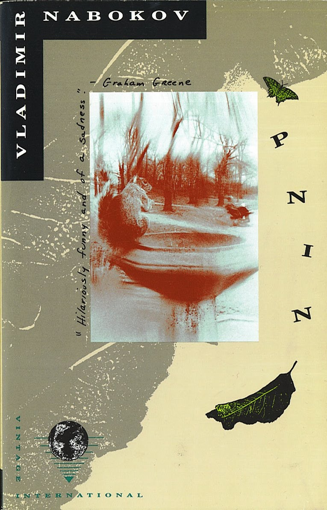

Title: Pnin

Author: Vladimir Nabokov

Published: 1953

Medium: Paperback (Vintage International, 0-679-72341-2)

Rating: ⭐⭐⭐⭐

---

Reached page 97. I'm enjoying it so far! It's cute, sad, and a little funny. Chapter four took a sharp turn where I had to start paying attention more. I actually had to read it twice to keep track of things and make sure I understood what was going on.

---

I'm flipping through Pnin about a week after I finished it. I've kept it on my desk to remind me to write a proper review, and I think it's good that I sat on it for as long as I did. If I were asked to rate it the moment I'd finished I would have probably given it three stars, but now I can confidently give it four.

The book is a portrait of a man, Pnin, an endearing, clumsy professor of the Russian language. We get to know him through various comical situations that he finds himself in, all relayed to us by an unknown narrator[^1]. This was, by far, the coolest part of the book: it all felt like intimate stories being told by a friend at the bar, Pnin some mutual acquantance of ours.

This style really came to life when the narrative dipped into the histories of a side character. It felt totally out of place and nearly put me to sleep, but I could tell it was deliberate.

One thing I also appreciated was the compassion of the narrator. Even when speaking of Liza, who betrays Pnin, his tone is full of love.

I think I liked the stories of him visiting the library, along with his house warming party, the most. I love the image of him cooped up in his car driving away, packed with his belongings.

Nabokov presented a beautiful, lovable man, and successfully made me care for him. There's not too much else I can say.

That's all I feel like writing for now.

8/25 Update: I saw a squirrel on campus today and it felt very Pnin-core.

