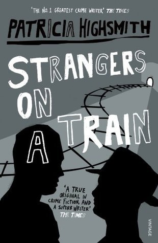

# Strangers on a Train

Title: [Strangers on a Train](https://en.wikipedia.org/wiki/Strangers_on_a_Train_(novel))

Author: Patricia Highsmith

Published: 1950

Medium: Kindle (epub)

Rating: ⭐⭐

---

I'm going to be honest: I didn't enjoy this book. It was well written, but my god, it was _boring!_ I kept waiting for it to pick up until around the middle when both murders happened and then I gave up hope. I did finish the thing, but it sure was a slog. And talk about a disapointing ending!

I don't have too many thoughts about it. I wouldn't exactly classify it as a psychological thriller, because the character's minds were too boring to really get lost inside. The aspects of Guy's guilt and atonement just didn't hit because I really _didn't care_ about him.

I agree with a goodreads review that it could have been a Novella.

Here are some notable quotes:

> Perhaps God and the Devil danced hand in hand around every single electron! He threw his cigarette at the wastebasket and missed.

> "I could break you down and make you kill someone. It might take different methods from the ones Bruno used on me, but it could be done."

> "My point is, that if society hasn't the right to take another person's life, then the law hasn't either."

And more specifically, some subtly gay ones:

> He might have been Bruno's lover, he thought suddenly

> Not only hadn't he ever fallen in love, but he didn't care too much about sleeping with women. He had never been able to stop thinking it was a silly business ... Once, one terrible time, he had started giggling.

> Bruno stared at him in terrified surprise. "Guy, what's the matter?" Bruno followed him. "Guy, wait! You don't think I'd do a thing like that, do you? I wouldn't in a million years!"
> "Don't touch me!"
> "_Guy!_" Bruno was almost crying.

> If he could strangle Anne, too, then Guy and he could really be together.

Overall, I give it...

⭐⭐

Two stars.

Now for some Woolf!