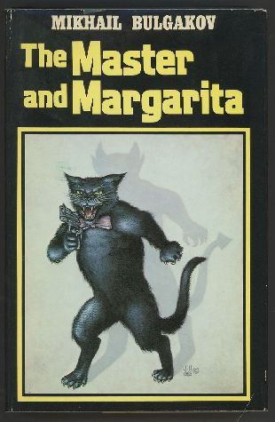
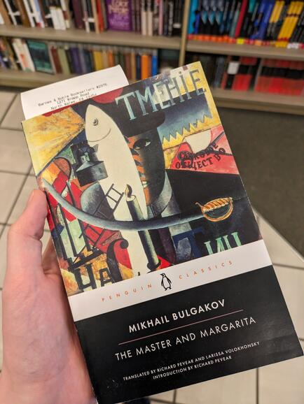

# The Master and Margarita

Title: [The Master and Margarita](https://en.wikipedia.org/wiki/The_Master_and_Margarita)

Author: Mikhail Bulgakov

Written: between 1928-1940

Medium: Kindle ([epub](</books/The Master and Margarita - Mikhail Bulgakob.epub>))

Rating: ⭐⭐⭐⭐⭐

---

Nothing could have prepared me for how absolutely unexpectedly *silly* this book was. Despite it's grand name and very refined beginning, the story quickly takes a turn for the whimsical. It makes me wonder if it had an influence on modern demonic comedy like *Good Omens*, since it really had the same sort of vibe.

I couldn't give you a proper overview of the plot even if you paid me, but that doesn't mean I didn't have a good time. The book's main narrative follows a discouraged writer and his wife, although the majority of the focus (and fun) is with the hijinks of Satan and three of his demons as they run about Moscow causing absolute chaos.

For the first half I read the Richard Pevear & Larissa Volokhonsky translation, which I found to be difficult to get through at bits (though the notes were very good) so I switched to the Hugh Aplin one, which I found much easier to enjoy (and also had notes here and there). I think that if I knew what was to come, I'd have been able to stick with the Peaver. The Aplin translation is more recent (2008), so I suspect that's why it was easier.

Like another bookbugger said, I really couldn't keep track of all the names! I'm not sure if this was because I'm not used to russian names, or just because they were meant to be that way (three different people with "Ivan" in their name, one guy named "Archibald Archibaldovich"). There are some scenes that were so goofy and funny that I know I'll be remembering them for a long time (a cat swinging around from a crystal chandalier unloading a Browning while holding a Primus), which brings me to my other question:

~~Where can I watch the movies? There seem to be many of them, but I can't find any guidance of how to see them. I'll keep looking.~~ I have acquired the most recent one.

Update: I have bought the book in paperback. Looking forward to giving the Peaver a second go!

## About the Film (2024)

Writing this a while after I actually watched, but wow. I'm absolutely blown away by this adaptation, and it has definitely allowed me to reflect and more fully appreciate the book. I saw some complaints about the tweaks the film made with the plot, but I thought they were very appropriate and amplified the emotion and chemistry between Master and Margarita. I think it brought out the best parts of the autobiographical aspects of the book.

Near the end I was afraid they would skip over a few scenes, but they got them in! The only thing I'm bummed about is not including the end scene where they confront Pilate... That was so powerful in the book and I would have loved to see it in the film. I can't complain, though, because they did such great things with everything else.

I highly, highly recommend you check it out. To find it, just search it up on Yandex, though if you need help feel free to reach out.