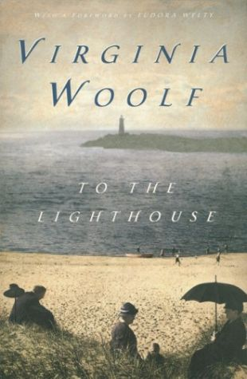
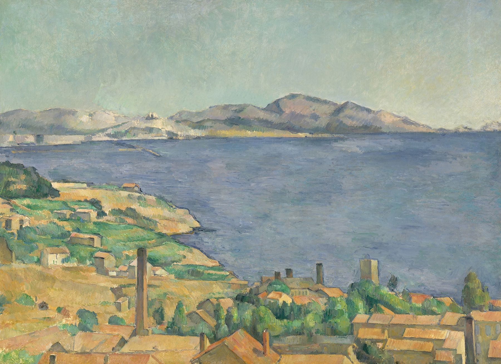

# To the Lighthouse

Title: To the Lighthouse

Author: Virginia Woolf

Published: 1927

Medium: Paperback (Harcourt, 0-15-690739-9)

Rating: 🌟🌟🌟🌟🌟 (New favorite book)

---

**July 9th, 2024**

I just couldn't wait to make this page. I can't believe I just read the greatest writing of my life in a Dunkin' Donuts of all places! I left the place literally grinning, I couldn't believe what I'd just read. (By the way, the "signature" Smore's Latte is just _meh_)

Okokok, I'm only finished the first part, _The Window_, but there's already so much that I need to back and pay more attention to. The writing is just transcendent of anything I've ever read before; the hopping from character to character, the motifs and symbols and themes, it all wraps me up in intrigue and astonishment and beauty. I'm so excited to map them out while getting lost in the tenderness of it all. I feel as though I've begun a great friendship. Absorbed. Complete.

---

I finished the most beautiful book I'd ever read in my life today. What do I even say now?

I made notes, lots of them. There is hardly a page of this book that I left untouched by my (twice sharpened) pencil. Of the many things this book has accomplished, one of them is convincing me completely of Woolf's mastery of the written word. Perhaps I'm being naive, but nothing I've ever read comes close to her level of talent, and I think that might be true for everything I ever _will_ read. But we'll see.

_To the Lighthouse_ accomplishes a style I have never seen before. It takes the stream of consciousness of _Mrs Dalloway_ and brings it into the warm air of the seaside, where the thoughts of the characters all melt together. The characters don't melt so that they lose any of their definition or individuality, but so that their truest inner selves are revealed and their similarities combine. Woolf's use of color and description gives the effect of an impressionist painting that is animated by the rising and setting of the sun, alternating currents of light that effect its mood.

> Beautiful and bright it should be on the surface, feathery and evanescent, one colour melting into another like the colours on a butterfly’s wing; but beneath the fabric must be clamped together with bolts of iron. (171)

Each character is surrounded by an individual aura of color. Originally, once I'd started to pick up some patterns, I thought that I could assign the colors to their respective characters, but Woolf did not make it so simple. Like in a painting, characters share colors, and characters' associated colors change as they rub off one another.

I was happy to find that Jack F. Stewart's essay _Color in "To the Lighthouse"_ analyzes this specifically. He takes a particular look at how the novel compares to Post-Impressionist painter Paul Cézanne.

> The outline and the colors are no longer distinct from each other. To the extent that one paints, one outlines; the more the colors harmonize, the more the outline becomes precise... —Paul Cézanne

I just can't get over the intense sense of dread this book bears, and I don't mean "dread" in a terribly negative way. In the beginning of the book Woolf makes one thing clear: every single one of her characters is terrified of death. Jumping between them as they go about their day, they're all brought together by the looming fear of it. They're aware of it in that looking-out-into-the-horizon way. But even though each and every one of them is burdened by the same thing, they refuse to acknowledge it to each other, and instead continue this fake dance of formalities and social gestures. I think it speaks a lot to the place, emotionally, that Virginia Woolf was in.

Time Passes is a masterpiece. No other piece of writing has hurt me the way Time Passes did. I'm just grateful that The Lighthouse was able to heal what Time Passes did.

Oh, and Mr. Carmichael might be one of my favorite characters ever.

## Flowers

I noticed a lot of color symbolism used in the book, and much of it was represented in flowers. Here I will attempt to "pick" out the different flowers mentioned and how I think they connect to the book's themes. ⚠️ UNDER CONSTRUCTION ⚠️

## Quotes

> Charles Tansley felt an extraordinary pride; felt the wind and the cyclamen and the violets for he was walking with a beautiful woman for the first time in his life. He had hold of her bag. (14)

> "It's too short," she said, "ever so much too short." (28)

> The very stone one kicks with one's boot will outlast Shakespeare. (35)

> and finally putting his pipe in his pocket and bending his magnificent head before her—who will blame him if he does homage to the beauty of the world?

> There it was before her—life. Life: she thought but she did not finish her thought. She took a look at life, for she had a clear sense of it there, something real, something private, which she shared neither with her children nor with her husband. A sort of transaction went on between them, in which she was on one side, and life was on another, and she was always trying to get the better of it (59)

> when the great clangor of the gong announced solemnly, authoritatively, that all those scattered about, in attics, in bedrooms, on little perches of their own, reading, writing, putting the last smooth to their hair, or fastening dresses, must leave all that, and the little odds and ends on their washing-tables and dressing-tables, and the novels on the bed-tables, and the diaries which were so private, and assemble in the dining-room for dinner. (82)

> And smiling she looked out of the window and said (thinking to herself, Nothing on earth can equal this happiness)—
>
> “Yes, you were right. It’s going to be wet tomorrow.” She had not said it, but he knew it. And she looked at him smiling. For she had triumphed again.

(These are ones I underlined at the beginning but then I got to Time Passes and I couldn't do it for fear of getting emotional.)

## Links

- https://en.wikipedia.org/wiki/The_Fisherman_and_His_Wife
- https://ryelandgardens.com/plants/perennials/clematis-jackmanii
- https://www.poetryfoundation.org/poems/45319/the-charge-of-the-light-brigade
- http://www.online-literature.com/virginia_woolf/
- http://www.cinemamuseum.org.uk/2019/hugh-stoddart-presents-to-the-lighthouse-1983/

<!-- 
Mr. Tansley admires Mrs. Ramsay:
> With stars in her eyes and veils in her hair, with **cyclamen and wild violets**—what nonsense was he thinking? (Page 14)

A main character, Lily, is introduced:
> Only Lily Briscoe, she was glad to find; and that did not mattter. (...) she would never marry; one could not take her painting very seriously (Page 17)

While Lily paints, she specifically notices the violet flowers:
> The **jacmanna[^1] was bright violet**; the wall staring white. She would not have considered it honest to tamper with the bright violet and the staring white (Page 18)

Lily observes:
> "It suddenly gets cold. The sun seems to give less heat," she said, looking about her, for it was bright enough, the grass still a soft deep green, the house starred in its greenery with **purple passion flowers**, and rooks dropping cool cries from the high blue. (Page 19)

As Lily Briscoe and Mr. Bankes walk through the garden, they stroll in and between [red-hot pokers, aka _kniphofia_](https://en.wikipedia.org/wiki/Kniphofia), which are **yellow** at base and **bright red** on top. 

(Maybe not so important, but on Page 21 the Ramsays' daughter, Cam, is described as "wild and fierce," refusing to "give a flower to" Mr Bankes.)

Geraniums planted in an urn occcupy Mr. Ramsay while he paces and thinks:
> The geranium in the urn became startlingly visible and, displayed among its leaves, he could see, without wishing it, that old, that obvious distinction between the two classes of men (Page 34)

These geraniums are later specified as red (Page 42).

> Minta must, they all must marry, since in the whole world whatever laurels might be tossed to her (Page 49)

Mrs. Ramsay becomes a rose (Page 38).

[^1]: As I [explained here](/blog/2024-07-03/), with _jacmanna_ Woolf is referring to [_Clematis Jackmanii_](https://www.gardenia.net/plant/clematis-jackmanii). -->
